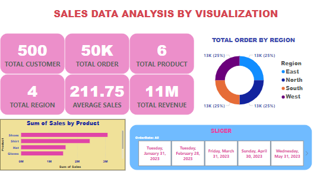

# LITA_Class_Documentation
A documentation of my class on Data Analysis with the Incubator Hub and Project work.

## Project Title: 
Data Analysis- Basics of Data Analysis

### Project Overview:
The aim and objective of this project is to have a good knowledge and understanding of Data Analysis, Foundations of Data - Data Generation, Data storage, Data Source, Data Structure, introduction to MSExcel, Basic Excel Functions, Reports and Dashboards in Excel, Project/Challenge.

### Data Sources: 
The primary source of Data is from LITA, CSV, and this an open source that can be freely downloaded from an open source online like kaggle.com, data.gov etc.

### Tools Used
- Microsoft Excel [download Here](https://www.microsoft.com)
  1. Data Generation and cleaning
  2. Explore and Visualize Data  
  3. Analyze Data
  4. Tell stories with Data
- SQL - Structured QUery Language for quering of Data
- GitHub for portfolio building
- Power BI

### FOUNDATIONS OF DATA
We need to have some level of Data Litracy, that is how we perceive Data so we can do some certain things or make meaning out of the Data set. These include

- Data Generation:
  
The way you generate your data would actually impact some of the things you would do with your Data afterward. The better the generated Data, the more value we get from our Data set.

- Data Cleaning:
This is the process of detecting and correcting corrupt or inaccurate records from a record set, table, or database and refers to identifying incomplete, incorrect, inaccurate or irrelevant parts of the data and then replacing, modifying, or deleting the dirty or coarse data.

- Data Storage:
The generated data must be stored somewhere so that the data set is accessible, else we loose the Data. And this can be done in 2 ways - premises or cloud.

- Data Structure:
 This is a data organization and storage format that is usually chosen for efficient access to data. And this can bee achieved in 3 ways - STRUCTURED DATA, a structured data simply means data is in a table format, also a structured Data is 90% ready for analysis. SEMI STRUCTURED DATA means data is not in a table format but in format like JSON, XML while UNSTRUCTURED DATA comes from audio, video, they are the media files.

 We do what is called ETL- Extract Transform and Load to restructure our data to bring our data to a structure that is reporting or analysis ready. ETL is simply the process of making our data set analysis ready

 ### DATA ANALYSIS LIFE CYCLE
 
 This is a cyclical process for gathering, analysing, and interpreting data. The phases are as shown below:
 
 - Ingestion: To connect to data source, to socket in
 - Transformation: once data is brought in, you may want to add or drop columns , change the data type etc. This is typically the ETL.
 - Modelling: Data modeling refers to the architecture that makes analysis possible. Here an Analyst brings different data close to one another to be able to bring out a single Report.
 - Visualization: This means simply turning data into visuals, charts, graphs. Visualization is what many people will see
 - Analysis: Data is evaluated and described by applying statistical and Logical techniques.
 - Presentation: Data is ready for presentation.

 
### Data cleaning Using Power BI 
 Recall that Data Cleaning means removing unwanted observations, outliers, fixing structural errors. It is also the process of detecting and correcting corrupt or inaccurate records from a record set, table, or database and refers to identifying incomplete, incorrect, inaccurate or irrelevant parts of the data and then replacing, modifying, or deleting the dirty or coarse data.

 ### Shown below are some TEXT Cleaning done Using Power BI
  
  
TEXT - CLEANING 2. Here I started by:
1. got my Data
2. Took it for Transformation
3. Removing empty 2 top rows, 
4. Replacing all the null values with @lita.org by clicking on REPLACE VALUES, 3. 3. Then removed the bottom 5 rows
5. Promoted the Header using USE FIRST ROW AS HEADERS
6. Removed the bottom 5 rows
7. Duplicated the Name column and SPLITED the Name copy column created by SPACE delimeter, at LEFT-MOST DELIMITER to get the First Name and Surname column having copied and removing the Original First Name and Surname Column
8. I then MERGE the First Name with the Email to form the Email address Column having duplicated the Email column.
9. Then finally renamed the Email Address column.
    
 
TEXT - CLEANING 3. Here: 
1. I got my Data
2. Took it for Transformation
3. I first removed Top 2 rows
4.  Removed an empty column
5. Removed bottom 5 rows
6. Promoted the header using first row as header
7. Then duplicated the First Name and the Surname and creating additional column copy respectively
8. I then copied and Removed the Full Name column
9. and finally MERGED the two column copies by SPACE seperator to get the Full Name.

 
TEXT - CLEANING 4. Here, after generating my Data and taking it for transformation: 
1. I first removed Top 2 rows
2. Removed an empty column
3. Promoted the header using first row as header
4. Removed bottom 5 rows
5. Duplicated the Email Address column
6. Then SPLITED the created column copy by @ delimiter at each occurrence of the delimiter
7. Then removed the unwanted columns (@lita.org) out of the 2 additional created columns
8. Again splitted the remaining column of the previous created column (the first name.surname) by dot (.) seperator at Left-most delimiter
9. And finally, I copied and removed the First Name and Surname column respectively and renamed them respectively.


# MY PROJECT WORK IN DATA ANALYSIS WITH THE INCUBATOR HUB

## PROJECT TITLE: SALES AND CUSTOMERS DATA ANALYSIS

## PROJECT 1: Sales Performance Analysis for a Retail Store

### Project Overview/Summary: This Project is base on two dataset Analysis, simply named Project 1 and 2.


In Project 1, I analyzed the sales performance of a retail store. 
I explored the sales data to uncover key insights such as top-selling products, regional 
performance, and monthly sales trends. The goal is to produce an interactive Power BI 
dashboard that highlights these findings

In Project 2, customer data subscription service was analyzed to identify 
segments and trends. This was aimed at understanding customer behavior, track subscription types, 
and identify key trends in cancellations and renewals. The final deliverable is a Power BI 
dashboard that presents my analysis.


## PROJECT 1 Procedure:

## 1. Using Excel:
   
### i. I Performed an initial exploration of the sales data. Use pivot tables to summarize 
total sales by product, region, and month and the results are as shown below:


- From the Total Sales by Product Pivot Table:
       - Shoes made the highest sale of  3,087,500
       - Followed by shirt at 2,450,000
       - Socks made the leastt sales of 912,500


- From the Total Sales by Region Pivot Table:

      - South made the highest sales of  4,675,000
      - Followed by East at 2,450,000
      - while the lowest sale came from West at 1,512,500


- From the Total Sales by Month Pivot Table:

The sales are as shown below in Descending order
Feb	 2,750,000 

Jul	 1,387,500 

Jan	 1,250,000 

Jun	 1,250,000 

Aug	 1,025,000 

Oct	 675,000 

Mar	 537,500 

Nov	 525,000 

May	 525,000 

Dec	 250,000 

Apr	 237,500 

Sep	 175,000 

September having the lowest sale should be as a result of school Resumption where parents and Guardian has to pay more attention to paying of school fees, and other school things.

 - From the Pivot Tables above the Grand Total is 10,587,500 

 
 ### ii. I Used Excel formulas to calculate metrics such as:
 
 - AVERAGE SALE PER PRODUCT


```EXCEL
=AVERAGEIF(C2:C50001,C2,H2:H50001)
```
Shirt	      326.6666667 = 327


```EXCEL
=AVERAGEIF(C2:C50001,C49983,H2:H50001)
```
Shoes	      308.75 = 309


```EXCEL
=AVERAGEIF(C2:C50001,C49984,H2:H50001)
```
Hat	        158.75 = 159


```EXCEL
=AVERAGEIF(C2:C50001,C49985,H2:H50001)
```
Socks	      121.6666667 = 122


```EXCEL
=AVERAGEIF(C2:C50001,C49986,H2:H50001)
```
Jacket	    140


```EXCEL
=AVERAGEIF(C2:C50001,C49987,H2:H50001)
```
Gloves	    200


- TOTAL REVENUE BY REGION
 


South	4,675,000   
```EXCEL
=SUMIF(D2:D50001,D49983,H2:H50001)
```


East	2,450,000   
```EXCEL
=SUMIF(D2:D50001,D49984,H2:H50001)
```

West	1,512,500   
```EXCEL
=SUMIF(D2:D50001,D49989,H2:H50001)
```


North	1,950,000   
```EXCEL
=SUMIF(D2:D50001,D49982,H2:H50001)
```


TOTAL REGION 10,587,500  
```EXCEL
=SUM(M12:M15)
```
 

### iii. Creating other interesting report:

The charts below summarizes the Sales Report at a glance


## 2. Using SQL:

Firstly, I migrated the Salesdataset into my SQL Server environment so I can write and 
validate my queries. The following queries were done:

### To see my SalesData Table, I wrote the query below:

      ```SQL
  select*from salesdata
  ``` 

### Then, I altered the SalesData Table to create additional column called TotalSales by writing the query below:

   ```SQL
   ALTER TABLE salesdata
  
    ADD TotalSales int
   ```

### Then UPDATE the SalesData Table with the query below:

   ```SQL
  UPDATE SalesData SET TotalSales = Quantity*UnitPrice
   ```

### The Image below are the SQL Queries as entered in SQL Server


### Then, I was able to Write queries to extract key insights based on the following questions: 

i. Retrieve the total sales for each product category

```SQL
SELECT Product, SUM(TotalSales) AS TOTAL_SALES
        FROM SalesData
           GROUP BY Product
```


ii. Find the number of sales transactions in each region

```SQL
    SELECT Region, COUNT(Customer_Id) AS Number_of_sales_transaction
         FROM SalesData
           GROUP BY Region
           ```


iii. Find the highest-selling product by total sales value

```SQL
    SELECT Product, SUM(TotalSales) AS Highest_sale_value
          FROM SalesData
            GROUP BY Product
              ORDER BY Highest_sale_value desc
              ```


iv. Calculate total revenue per product

```SQL
SELECT Product, SUM(TotalSales) AS Total_revenue
        FROM SalesData
          GROUP BY Product
            ORDER BY Total_revenue DESC
```


v. Calculate monthly sales totals for the current year

```SQL
SELECT MONTH(orderdate) AS Sales_month,
         SUM(TotalSales) AS TOTAL_SALES
          FROM SalesData
           WHERE YEAR(OrderDate) = YEAR(GETDATE())
            GROUP BY MONTH(OrderDate)
             ORDER BY Sales_month
```


vi. Find the top 5 customers by total purchase amount

```SQL
SELECT TOP 5 Customer_Id, SUM(TotalSales) AS TOTAL_SALES
       FROM SalesData
        GROUP BY Customer_Id
         ORDER BY TOTAL_SALES
```


vii. Calculate the percentage of total sales contributed by each region.

```SQL
SELECT REGION, SUM(TotalSales) AS TOTAL_SALES,
       (SUM(TotalSales) / (SELECT SUM(TotalSales)
        FROM SalesData)) * 100 AS PERCENTAGETOTAL_SALES
         FROM SalesData
          GROUP BY REGION
           ORDER BY TOTAL_SALES
```


viii. Identify products with no sales in the last quarter

```SQL
SELECT Product, Region
       FROM SalesData
        WHERE Product NOT IN (
         SELECT Product
          FROM SalesData
           WHERE OrderDate >=
            DATEADD (QUARTER, -1, GETDATE()))
```


## 3. Using Power BI:
i. Create a dashboard that visualizes the insights found in Excel and SQL. The 
dashboard should include a sales overview, top-performing products, and regional breakdowns.

### PROCEDURES:

- Firstly I migrated the Dataset (SALEDATA) to Power BI

- Then Transformed the Data, added a custom column called Sales and populating the column as shown below:

= [Quantity]*[UnitPrice]

- Then I created all the MEASURES needed and

- Finally making the MEASURES part of my VISUALS. The Visuals are as shown below:




## PROJECT 2 Procedure:

## 1. Using Excel:

i. I analyzed customer data using pivot tables to find subscription patterns and the results are as shown below:


- REGION BY ACTIVE SUBSCRIPTION
  	
Region	Sum of Active Subscription

East	 18,750

North	 7,500

South	 7,500

West	 7,500

Grand Total	 41,250

Here the EAST REGION has the higest number of ACTIVE Subscribers signaling high retention rate and Customers satisfaction.

While the remaining three Regions has the same number of active Subscribers but very far below the Eastern Region, quality and cost of the product should be looked into.


- REGION BY CHURN SUBSCRIPTION/ATTRITION

Region	          Sum of Churn /attrition

East	                0

North	                11,250

South	                11,250

West	                11,250

Grand Total	          33,750

Here, East Region has zero attrition, which means they have high retention rate, which signals high customers satisfaction.

With other 3 remaining regions having same number of attrition signaling that customers satisfaction should be enhanced and product quality and affordability should be looked into.


- CUSTOMER BY SUBSCRIPTION DURATION

Customer Name	              Sum of SubscriptionDuration in Days

Alex	                        1,368,750
 
Anna	                        1,368,750

Chris	                        1,368,750

Dan                           1,372,500

Ella	                        1,368,750

Eva	                          1,368,750

Grace	                        1,372,500

James	                        1,368,750

Jane	                        1,368,750

John	                        1,368,750

Liam	                        1,368,750

Maria	                        1,368,750

Mike	                        1,368,750

Nina	                        1,372,500

Paul	                        1,372,500

Rob	                          1,372,500

Sara	                        1,368,750

Sophia	                      1,372,500

Tom	                          1,368,750

Zoe	                          1,372,500

Grand Total	                  27,401,250


ii. Calculate the average subscription duration and identify the most popular 
subscription types


REGION BY AVERAGE SUBSCRIPTION DURATION	Using Pivot Table:

Region	       Average of SubscriptionDuration in Days
East	                365 
North	                365 
South	                365 
West	                365 
Grand Total	          365


AVERAGE SUBSCRIPTION DURATION	Using Excel Calculation matrix:

```excel
=AVERAGE(I2:I75001)
```
giving 365


- The most popular subscription types:

 is 37,500 as shown in the formula below

```excel
=COUNTIFS(D2:D75001,D74982)
```


 is 18,750 as shown below:

```excel
=COUNTIFS(D2:D75001,D74981)
```

     
 is 18,750 as shown below:

```excel
=COUNTIFS(D2:D75001,D74983)
```

Therefore the MOST POPULAR SUBSCRIPTION TYPE is BASIC


iii. Create any other interesting reports

- Total number of Customers is 75,000

```excel
=COUNTA(B2:B75001)
```


- Total number of Active Subscribers is 41,250

```excel
=SUM(J2:J75001)
```


- Total number of churn Subscribers is 33,750

```
excel
=SUM(K2:K75001)
```

## 2. SQL:

I migrated the dataset into SQL Server environment to write 
and validate my queries.

Then Altered the Customer Data to add Subscription Duration Column by writing the query below:

```sl
ALTER TABLE CUSTOMERDATA
ADD Subscriptionduration int
```

Then Populated the Column by

The following queries were written to extract key insights based on the following questions:

- Retrieve the total number of customers from each region.

```SQL
SELECT Region, COUNT(CustomerName) AS TotalCustomer
FROM CUSTOMERDATA
GROUP BY Region
```

- Find the most popular subscription type by the number of customers.

```sql
select top 1 SubscriptionType, count(*)
as numberofcustomers
from customerdata
group by subscriptiontype
order by count(*) desc;
```

OR

```SQL
SELECT TOP 1 SUBSCRIPTIONTYPE, COUNT(CUSTOMERID) AS NUMBER_OF_CUSTOMER
FROM CUSTOMERS_TABLE
GROUP BY SUBSCRIPTIONTYPE
ORDER BY NUMBER_OF_CUSTOMER desc
```

- Find customers who canceled their subscription within 6 months.

  ```SQL
  SELECT CUSTOMERID, CUSTOMERNAME, SUBSCRIPTIONSTART, SUBSCRIPTIONEND,
DATEDIFF(MONTH, SUBSCRIPTIONSTART, SUBSCRIPTIONEND) AS SUBSCRIPTION_DURATION
FROM CUSTOMERS_TABLE
WHERE SUBSCRIPTIONEND IS NOT NULL
AND DATEDIFF(MONTH, SUBSCRIPTIONSTART, SUBSCRIPTIONEND) <=6
ORDER BY SUBSCRIPTION_DURATION
```

- Calculate the average subscription duration for all customers.
o find customers with subscriptions longer than 12 months.

- Calculate total revenue by subscription type.

Total Revenue by Basic Subscription Type is 74,756,784

```sql
select sum(revenue) as TotalRevenue from CUSTOMERDATA
where subscriptiontype = 'basic'
```

Total Revenue by Standard Subscription Type is 37,482,120

```sql
select sum(revenue) as TotalRevenue from CUSTOMERDATA
where subscriptiontype = 'Standard'
```

Total Revenue by Premium Subscription Type is 37,580,782

```sql
select sum(revenue) as TotalRevenue from CUSTOMERDATA
where subscriptiontype = 'Premium'
```


- Find the top 3 regions by subscription cancellations.

```SQL
SELECT TOP 3 REGION, COUNT(CANCELED) AS NUMBER_SUBSCRIPTION_CANCELLATION
FROM CUSTOMERDATA
GROUP BY REGION
ORDER BY NUMBER_SUBSCRIPTION_CANCELLATION DESC
```
o find the total number of active and canceled subscriptions.


### Data Sources
### Tools used
### Data cleaning and Preparation
### Exploratory Data Analysis
### Data Analysis... codes used

